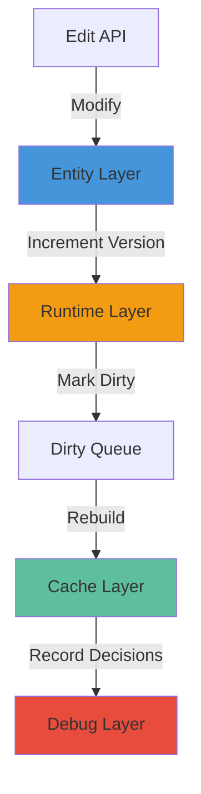

## Overview

Wire is built on a strict **4-layer architecture** that separates authoritative data from derived state, ensuring data integrity and making the system easy to serialize, debug, and extend.

<Frame>
  
</Frame>

Each layer serves a distinct purpose and has clear rules about what data it contains and how it's managed:

<CardGroup cols={2}>
  <Card title="Entity Layer" icon="database">
    Persistent, authoritative data that defines the network topology
  </Card>
  <Card title="Cache Layer" icon="memory">
    Derived, rebuildable data for rendering and spatial queries
  </Card>
  <Card title="Runtime Layer" icon="clock">
    Transient version tracking for incremental recalculation
  </Card>
  <Card title="Debug Layer" icon="bug">
    Session-only diagnostic information for development
  </Card>
</CardGroup>

## Layer 1: Entity (Persistent)

The Entity Layer contains the **authoritative data model** that gets saved and loaded. This is the only layer that's persisted to disk.

### Core Entity Types

```cpp wire/core/entities.hpp
struct EditState {
  // Entity-layer authoritative stores.
  ObjectStore<Pole> poles;
  ObjectStore<Port> ports;
  ObjectStore<Anchor> anchors;
  ObjectStore<Bundle> bundles;
  ObjectStore<Span> spans;
  ObjectStore<Attachment> attachments;
};
```

Six fundamental entity types define the entire network:

<AccordionGroup>
  <Accordion title="Pole — Support structures">
    Utility poles, towers, or other vertical support structures. Poles own ports and anchors.
    
    ```cpp
    struct Pole {
      ObjectId id;
      Transformd world_transform;
      double height_m;
      PoleKind kind;
      PoleTypeId pole_type_id;
      // ... context and generation metadata
    };
    ```
  </Accordion>
  
  <Accordion title="Port — Connection endpoints">
    Attachment points where wires connect. Ports can be auto-generated from pole type templates or manually placed.
    
    ```cpp
    struct Port {
      ObjectId id;
      ObjectId owner_pole_id;
      Vec3d world_position;
      PortKind kind;
      PortLayer layer;
      // ... template slot association
    };
    ```
  </Accordion>
  
  <Accordion title="Span — Wire connections">
    Physical wire connections between two ports. Each span references a bundle that defines conductor properties.
    
    ```cpp
    struct Span {
      ObjectId id;
      ObjectId port_a_id;
      ObjectId port_b_id;
      SpanKind kind;
      SpanLayer layer;
      ObjectId bundle_id;
      // ... anchor and generation metadata
    };
    ```
  </Accordion>
  
  <Accordion title="Bundle — Multi-conductor groups">
    Defines properties for groups of parallel conductors (like 3-phase power lines).
    
    ```cpp
    struct Bundle {
      ObjectId id;
      int conductor_count;
      double phase_spacing_m;
      BundleKind kind;
      // ... visual policy settings
    };
    ```
  </Accordion>
  
  <Accordion title="Anchor — Support points">
    Support-only attachment points (insulators, mounting hardware) that don't carry logical connections.
    
    ```cpp
    struct Anchor {
      ObjectId id;
      ObjectId owner_pole_id;
      Vec3d world_position;
      AnchorSupportKind support_kind;
      double support_strength;
    };
    ```
  </Accordion>
  
  <Accordion title="Attachment — Span-mounted objects">
    Parametric objects attached along spans at position `t` ∈ [0,1] (dampers, spacers, markers).
    
    ```cpp
    struct Attachment {
      ObjectId id;
      ObjectId span_id;
      double t;  // Parametric position [0,1]
      AttachmentKind kind;
      double offset_m;
    };
    ```
  </Accordion>
</AccordionGroup>

### Entity Storage

All entities are stored in `ObjectStore<T>` containers, which provide:

- Fast lookup by `ObjectId` (64-bit unique identifier)
- Stable iteration order
- Automatic index maintenance
- Concept-based type constraints

```cpp wire/core/object_store.hpp
template <HasObjectId T> class ObjectStore {
  std::vector<T> items_;
  std::unordered_map<ObjectId, std::size_t> index_by_id_;
  
  T* find(ObjectId id);  // O(1) lookup
  T& insert(T&& value);  // Insert or update
  bool remove(ObjectId id);  // Swap-and-pop removal
};
```

<Note>
The `EditState` struct in `core_state.hpp:20-28` is the **single source of truth** for all persistent data. Everything else is derived from this state.
</Note>

## Layer 2: Cache (Derived)

The Cache Layer contains **regenerable computed data** that's never persisted. These caches are rebuilt from Entity Layer data when needed.

### Cache Components

```cpp wire/core/core_state.hpp
struct CacheState {
  // Derived cache layer. Not treated as authoritative topology state.
  GeometrySettings geometry_settings{};
  CurveCache curve_cache{};
  BoundsCache bounds_cache{};
  VisualSettings visual_settings{};
  VisualCache visual_cache{};
};
```

<CardGroup cols={3}>
  <Card title="CurveCache" icon="wave-sine">
    **Sampled wire geometry** with configurable sag simulation
    
    ```cpp
    struct CurveCacheEntry {
      std::vector<Vec3d> points;
      std::uint64_t source_version;
    };
    ```
  </Card>
  
  <Card title="BoundsCache" icon="cube">
    **Spatial bounding boxes** for culling and raycasting
    
    ```cpp
    struct BoundsCacheEntry {
      AABBd whole;
      std::vector<AABBd> segments;
      std::uint64_t source_version;
    };
    ```
  </Card>
  
  <Card title="VisualCache" icon="eye">
    **Support structures** (arms, insulators, fittings)
    
    ```cpp
    struct SpanVisualCacheEntry {
      std::vector<VisualPart> parts;
      std::uint64_t source_version;
    };
    ```
  </Card>
</CardGroup>

### Cache Invalidation

Caches are invalidated using version tracking. Each cache entry stores the `source_version` of the entity data it was built from:

```cpp
struct CurveCacheEntry {
  std::vector<Vec3d> points{};          // Derived data
  std::uint64_t source_version = 0;     // Entity data version
};
```

When entity data changes, its version counter increments. The cache is rebuilt if `source_version` doesn't match the current entity version.

<Warning>
Never modify cache data directly. Always use `CoreState::Commit()` to trigger proper cache regeneration through the dirty tracking system.
</Warning>

## Layer 3: Runtime (Transient)

The Runtime Layer manages **version tracking and dirty flags** for incremental recalculation. This layer is rebuilt on load and never persisted.

### Span Runtime State

```cpp wire/core/core_state.hpp
struct SpanRuntimeState {
  ObjectId span_id = kInvalidObjectId;
  std::uint64_t data_version = 0;       // Entity data version
  std::uint64_t geometry_version = 0;   // CurveCache version
  std::uint64_t bounds_version = 0;     // BoundsCache version
  std::uint64_t render_version = 0;     // VisualCache version
  std::uint64_t raycast_version = 0;    // Raycast structure version
  DirtyBits dirty_bits = DirtyBits::kNone;
};
```

Each span tracks five independent version counters. When a span is modified, only the relevant versions are incremented, allowing fine-grained incremental updates.

### Dirty Tracking System

```cpp wire/core/core_state.hpp
enum class DirtyBits : std::uint32_t {
  kNone = 0,
  kTopology = 1u << 0,    // Connectivity changed
  kGeometry = 1u << 1,    // Wire shape changed
  kBounds = 1u << 2,      // Bounding box invalidated
  kRender = 1u << 3,      // Visual parts invalidated
  kRaycast = 1u << 4,     // Raycast structure invalidated
};
```

Dirty flags track which subsystems need recalculation:

```cpp
struct DirtyQueue {
  std::vector<ObjectId> topology_dirty_span_ids;
  std::vector<ObjectId> geometry_dirty_span_ids;
  std::vector<ObjectId> bounds_dirty_span_ids;
  std::vector<ObjectId> render_dirty_span_ids;
  std::vector<ObjectId> raycast_dirty_span_ids;
};
```

<Info>
See [Dirty Tracking](/concepts/dirty-tracking) for a detailed explanation of the version system and propagation rules.
</Info>

## Layer 4: Debug (Session)

The Debug Layer contains **non-authoritative diagnostic information** that's useful during development but never persisted.

### Debug Records

```cpp wire/core/debug_types.hpp
// Path generation decision diagnostics
struct PathDirectionEvaluationDebug {
  PathDirectionChosen chosen;
  PathDirectionCostBreakdown forward_cost;
  PathDirectionCostBreakdown reverse_cost;
  std::string reason;
};

// Slot selection decision diagnostics
struct SlotSelectionDebugRecord {
  ObjectId pole_id;
  ConnectionCategory category;
  int selected_slot_id;
  std::vector<SlotCandidateDebug> candidates;
};
```

### Debug Data Usage

Debug records help you understand **why** the system made specific decisions:

```cpp
CoreView view = state.view();

// Check why a path chose forward vs. reverse direction
const auto& debug = view.last_path_direction_debug();
if (debug.chosen == PathDirectionChosen::kReverse) {
  std::cout << "Reversed because: " << debug.reason << std::endl;
}

// Inspect slot selection decisions
for (const auto& record : view.slot_selection_debug_records()) {
  std::cout << "Pole " << record.pole_id 
            << " selected slot " << record.selected_slot_id << std::endl;
}
```

<Note>
Debug records are accumulated during generation and cleared when you call `clear_path_direction_debug_records()` or `clear_slot_selection_debug_records()`.
</Note>

## Layer Interaction Rules

### Data Flow



### Access Patterns

<Steps>
  <Step title="Modifications">
    All changes go through `CoreState` edit methods (e.g., `AddPole()`, `MovePole()`)
  </Step>
  <Step title="Dirty Propagation">
    Edits mark affected spans dirty and increment version counters
  </Step>
  <Step title="Commit">
    Call `CoreState::Commit()` to process dirty queues and rebuild caches
  </Step>
  <Step title="Query">
    Use `CoreView` for read-only access to all layers
  </Step>
</Steps>

```cpp
CoreState state;

// 1. Modify entity data
auto result = state.AddPole(transform, 10.0);
ObjectId pole_id = result.value;

// 2. Commit triggers dirty processing
auto commit = state.Commit();
std::cout << "Processed " << commit.recalc_stats.total_processed() 
          << " dirty items" << std::endl;

// 3. Query via read-only view
CoreView view = state.view();
const Pole* pole = view.poles().find(pole_id);
```

### Persistence Rules

| Layer | Persisted? | Rebuild On Load? |
|-------|-----------|------------------|
| **Entity** | ✅ Yes | — |
| **Cache** | ❌ No | ✅ Yes |
| **Runtime** | ❌ No | ✅ Yes |
| **Debug** | ❌ No | ❌ No |

<Warning>
The Cache and Runtime layers are **always** rebuilt from Entity data after deserialization. Never assume cached data survives a save/load cycle.
</Warning>

## Benefits of Layer Separation

<CardGroup cols={2}>
  <Card title="Data Integrity" icon="shield-check">
    Single source of truth (Entity Layer) prevents data corruption and inconsistency
  </Card>
  <Card title="Simple Serialization" icon="floppy-disk">
    Only one layer needs serialization, reducing complexity and file size
  </Card>
  <Card title="Incremental Updates" icon="gauge-high">
    Version tracking enables efficient partial recalculation for large networks
  </Card>
  <Card title="Easy Debugging" icon="magnifying-glass">
    Clear separation makes it obvious where data lives and how it's computed
  </Card>
  <Card title="Cache Flexibility" icon="arrows-rotate">
    Derived caches can be rebuilt with different settings without losing data
  </Card>
  <Card title="Extensibility" icon="puzzle-piece">
    New cache types can be added without modifying the entity model
  </Card>
</CardGroup>

## Next Steps

<CardGroup cols={2}>
  <Card title="Entity Layer" icon="database" href="/concepts/entity-layer">
    Deep dive into the six entity types
  </Card>
  <Card title="Data Model" icon="diagram-project" href="/concepts/data-model">
    Understand relationships and ownership
  </Card>
  <Card title="Dirty Tracking" icon="clock" href="/concepts/dirty-tracking">
    Learn the version and dirty flag system
  </Card>
  <Card title="Core State API" icon="code" href="/api/core-state">
    Explore the editing and query API
  </Card>
</CardGroup>