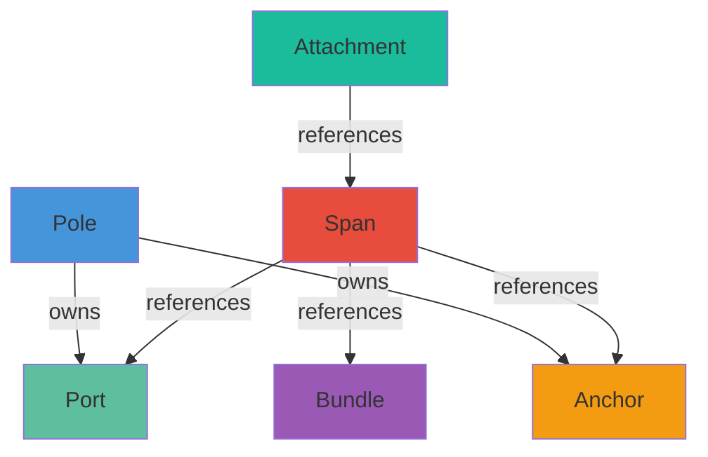

## Overview

Wire's data model is built around six fundamental entity types that work together to represent utility pole networks. Understanding the relationships and ownership rules between these entities is essential for working with the API.

<Frame>
  
</Frame>

## Entity Hierarchy

### Ownership Structure

Wire uses a clear ownership hierarchy where parent entities "own" their children:



<Note>
**Ownership vs. Reference**: Poles *own* ports and anchors (they're destroyed when the pole is deleted). Spans *reference* ports and bundles (they're independent entities that may outlive the span).
</Note>

## Entity Relationships

### Pole ↔ Port/Anchor

**Poles own ports and anchors.** When a pole is moved, all owned endpoints move with it. When a pole is deleted, all owned endpoints are deleted.

```cpp
struct Pole {
  ObjectId id;
  Transformd world_transform;  // Authoritative position
  double height_m;
  // ...
};

struct Port {
  ObjectId id;
  ObjectId owner_pole_id;      // Parent relationship
  Vec3d world_position;         // Derived from pole transform + local offset
  // ...
};

struct Anchor {
  ObjectId id;
  ObjectId owner_pole_id;      // Parent relationship
  Vec3d world_position;
  // ...
};
```

### Querying Owned Endpoints

Use the **RelationIndex** to efficiently find all ports and anchors owned by a pole:

```cpp
struct RelationIndex {
  std::unordered_map<ObjectId, std::vector<ObjectId>> ports_by_pole;
  std::unordered_map<ObjectId, std::vector<ObjectId>> anchors_by_pole;
  std::unordered_map<ObjectId, std::vector<ObjectId>> spans_by_bundle;
};
```

Example usage:

```cpp
CoreView view = state.view();
const RelationIndex& index = view.relation_index();

// Find all ports owned by a pole
auto it = index.ports_by_pole.find(pole_id);
if (it != index.ports_by_pole.end()) {
  for (ObjectId port_id : it->second) {
    const Port* port = view.ports().find(port_id);
    // Use port...
  }
}
```

<Tip>
Use `CoreState::GetPoleDetail()` for a convenient way to query all ports and anchors owned by a pole:

```cpp
PoleDetailInfo detail = state.GetPoleDetail(pole_id);
for (const Port* port : detail.owned_ports) {
  std::cout << "Port: " << port->display_id << std::endl;
}
```
</Tip>

### Span ↔ Port/Bundle

**Spans reference ports and bundles** to create connections. A span connects exactly two ports and optionally references a bundle that defines conductor properties.

```cpp wire/core/entities.hpp
struct Span {
  ObjectId id;
  ObjectId port_a_id;        // Source port reference
  ObjectId port_b_id;        // Target port reference
  ObjectId bundle_id;        // Optional conductor properties
  ObjectId anchor_a_id;      // Optional support anchor
  ObjectId anchor_b_id;      // Optional support anchor
  SpanKind kind;
  SpanLayer layer;
  // ...
};
```

### Connection Semantics

<AccordionGroup>
  <Accordion title="Port Requirements">
    - Each span must reference **exactly two ports**
    - Ports must exist when the span is created
    - Ports can belong to the same pole (self-loop) or different poles
    - Zero-length spans (same port twice) are rejected by validation
  </Accordion>
  
  <Accordion title="Bundle Association">
    - Bundles define **shared conductor properties** for multiple spans
    - Multiple spans can reference the same bundle (parallel conductors)
    - Bundle references are optional (`bundle_id` may be `kInvalidObjectId`)
    - Bundles are independent entities that outlive individual spans
  </Accordion>
  
  <Accordion title="Anchor Support">
    - Anchors provide **structural support** without logical connections
    - Anchor references are optional (most spans don't use them)
    - Anchors affect visual geometry generation (support arms, insulators)
    - Anchors don't participate in topology routing
  </Accordion>
</AccordionGroup>

### Querying Connections

Use the **ConnectionIndex** to efficiently find all spans connected to a port or anchor:

```cpp wire/core/core_state.hpp
struct ConnectionIndex {
  std::unordered_map<ObjectId, std::vector<ObjectId>> spans_by_port;
  std::unordered_map<ObjectId, std::vector<ObjectId>> spans_by_anchor;
};
```

Example usage:

```cpp
CoreView view = state.view();
const ConnectionIndex& index = view.connection_index();

// Find all spans connected to a port
auto it = index.spans_by_port.find(port_id);
if (it != index.spans_by_port.end()) {
  std::cout << "Port " << port_id << " has " 
            << it->second.size() << " connected spans" << std::endl;
  
  for (ObjectId span_id : it->second) {
    const Span* span = view.spans().find(span_id);
    // Process span...
  }
}
```

## Bundle System

### Multi-Conductor Groups

Bundles represent **groups of parallel conductors** that share properties. This is essential for modeling 3-phase power lines, communication cables, and other multi-wire systems.

```cpp wire/core/entities.hpp
struct Bundle {
  ObjectId id;
  int conductor_count;          // Number of parallel wires
  double phase_spacing_m;       // Distance between conductors
  BundleKind kind;              // kLowVoltage, kHighVoltage, etc.
  
  // Visual policy (authoritative settings, not geometry)
  double visual_sag_ratio;
  double visual_wire_radius_m;
  bool visual_use_reference_length;
};
```

### Bundle Kinds

```cpp wire/core/entities.hpp
enum class BundleKind : std::uint8_t {
  kLowVoltage = 0,      // Residential/commercial distribution
  kHighVoltage = 1,     // Transmission lines
  kCommunication = 2,   // Phone, cable, data
  kOptical = 3,         // Fiber optic
};
```

<CardGroup cols={2}>
  <Card title="Low Voltage" icon="bolt">
    Typical residential/commercial distribution (120V-480V)
  </Card>
  <Card title="High Voltage" icon="bolt-lightning">
    Transmission lines (>1kV), often 3-phase with larger spacing
  </Card>
  <Card title="Communication" icon="tower-broadcast">
    Phone, cable TV, data lines, typically smaller conductors
  </Card>
  <Card title="Optical" icon="circle-nodes">
    Fiber optic cables with minimal spacing requirements
  </Card>
</CardGroup>

### Bundle Templates

Wire provides a **template system** for bundles that defines default properties and validation rules:

```cpp wire/core/workflow_types.hpp
struct BundleTemplate {
  BundleKind id;
  std::string name;
  ConnectionCategory category;
  SpanLayer default_layer;
  bool is_electric;
  bool preserve_conductor_identity;
  
  // Count constraints
  BundleCountRuleKind count_rule;
  int fixed_count;              // For kFixed rules
  int min_count, max_count;     // For kRange rules
  int default_count;
  
  double default_spacing_m;
  bool allow_mirror;             // Allow left/right mirroring
};
```

Templates are registered during `CoreState` initialization and queried during generation:

```cpp
const BundleTemplate* tmpl = state.find_bundle_template(BundleKind::kLowVoltage);
if (tmpl->count_rule == BundleCountRuleKind::kFixed) {
  // Must use exactly fixed_count conductors
}
```

## Attachment System

### Parametric Span Objects

Attachments are objects positioned **parametrically along spans** using a normalized coordinate `t` ∈ [0, 1].

```cpp wire/core/entities.hpp
struct Attachment {
  ObjectId id;
  ObjectId span_id;          // Parent span reference
  double t;                  // Position: 0=port_a, 1=port_b
  AttachmentKind kind;
  double offset_m;           // Perpendicular offset from curve
};
```

### Attachment Kinds

```cpp wire/core/entities.hpp
enum class AttachmentKind : std::uint8_t {
  kGeneric = 0,    // Unspecified attachment
  kDamper = 1,     // Vibration damper
  kSpacer = 2,     // Conductor spacer
  kMarker = 3,     // Visibility marker (balls, flags)
};
```

<Info>
Attachments reference spans but **don't affect topology or connectivity**. They're purely visual/physical details.
</Info>

## ID Management

### Persistent 64-bit IDs

All entities use **64-bit persistent IDs** that are never reused:

```cpp wire/core/id.hpp
using ObjectId = std::uint64_t;
constexpr ObjectId kInvalidObjectId = 0;

class IdGenerator {
  ObjectId next() { return next_id_++; }  // Monotonic increment
  ObjectId peek() const { return next_id_; }  // Preview next ID
};
```

### Display IDs

Each entity also has a human-readable `display_id` string:

```cpp
struct Pole {
  ObjectId id;            // 12345678
  std::string display_id; // "POLE-000042"
  // ...
};
```

Display IDs are generated using counters per entity type:

```cpp wire/core/id.hpp
std::string make_display_id(std::string_view prefix, ObjectId id, int pad_width = 6);
// Example: make_display_id("SPAN", 42, 6) → "SPAN-000042"
```

<Warning>
**Never reuse ObjectIds.** Even if an entity is deleted, its ID must never be assigned to a new entity. This ensures references remain unambiguous during undo/redo and serialization.
</Warning>

## Layer and Classification System

### Port Layers

Ports are classified by **layer**, which groups them by electrical or communication type:

```cpp wire/core/entities.hpp
enum class PortLayer : std::uint8_t {
  kUnknown = 0,
  kHighVoltage = 1,
  kLowVoltage = 2,
  kCommunication = 3,
  kOptical = 4,
};
```

Layers are used during automatic generation to ensure proper slot selection and avoid mixing incompatible connection types.

### Span Layers

Spans inherit layer classification from their ports:

```cpp wire/core/entities.hpp
enum class SpanLayer : std::uint8_t {
  kUnknown = 0,
  kHighVoltage = 1,
  kLowVoltage = 2,
  kCommunication = 3,
  kOptical = 4,
};
```

### Connection Categories

The **ConnectionCategory** enum provides a higher-level classification used during generation:

```cpp wire/core/entities.hpp
enum class ConnectionCategory : std::uint8_t {
  kHighVoltage = 0,
  kLowVoltage = 1,
  kCommunication = 2,
  kOptical = 3,
  kDrop = 4,         // Service drops to buildings
};
```

<Tip>
During generation, `ConnectionCategory` is mapped to `PortLayer` and `SpanLayer` using helper functions in `CoreState`:

```cpp
PortLayer layer = category_to_port_layer(ConnectionCategory::kLowVoltage);
// Returns PortLayer::kLowVoltage
```
</Tip>

## Topology Validation

### Validation Rules

Wire enforces several **topology invariants** during validation:

```cpp wire/core/core_state.hpp
struct ValidationResult {
  std::vector<ValidationIssue> issues;
  
  bool has_errors() const;
  bool ok() const { return !has_errors(); }
};

enum class ValidationSeverity : std::uint8_t {
  kError = 0,     // Must be fixed
  kWarning = 1,   // Should be reviewed
};
```

### Common Validation Issues

<AccordionGroup>
  <Accordion title="Dangling References">
    **Error**: Span references a port or bundle that doesn't exist
    
    ```cpp
    // Detected by ValidateFast()
    if (!view.ports().contains(span.port_a_id)) {
      issues.push_back({.severity = kError, 
                        .code = "DANGLING_PORT",
                        .message = "Span references missing port",
                        .object_id = span.id});
    }
    ```
  </Accordion>
  
  <Accordion title="Zero-Length Spans">
    **Error**: Span connects a port to itself
    
    ```cpp
    if (span.port_a_id == span.port_b_id) {
      issues.push_back({.severity = kError,
                        .code = "ZERO_LENGTH_SPAN",
                        .message = "Span has same port for both endpoints"});
    }
    ```
  </Accordion>
  
  <Accordion title="Orphaned Endpoints">
    **Warning**: Port or anchor not owned by any pole
    
    ```cpp
    if (!view.poles().contains(port.owner_pole_id)) {
      issues.push_back({.severity = kWarning,
                        .code = "ORPHANED_PORT",
                        .message = "Port owner pole not found"});
    }
    ```
  </Accordion>
  
  <Accordion title="Index Inconsistency">
    **Error**: Connection index doesn't match entity data
    
    This indicates internal corruption and should never happen in normal usage.
  </Accordion>
</AccordionGroup>

### Running Validation

```cpp
// Fast validation (topology only, runs automatically on commit)
ValidationResult fast = state.ValidateFast();
if (!fast.ok()) {
  for (const auto& issue : fast.issues) {
    std::cerr << issue.code << ": " << issue.message << std::endl;
  }
}

// Full validation (includes geometry checks, opt-in)
auto commit = state.Commit({.run_validate = true});
if (!commit.validation.ok()) {
  // Handle validation failures
}
```

<Warning>
Validation is **non-destructive** — it reports issues but never modifies data. You must manually fix validation errors by editing or deleting problematic entities.
</Warning>

## Indexes and Queries

### Index Types

Wire maintains two types of indexes for efficient querying:

```cpp wire/core/core_state.hpp
// Parent → children relationships
struct RelationIndex {
  std::unordered_map<ObjectId, std::vector<ObjectId>> ports_by_pole;
  std::unordered_map<ObjectId, std::vector<ObjectId>> anchors_by_pole;
  std::unordered_map<ObjectId, std::vector<ObjectId>> spans_by_bundle;
};

// Endpoint → connections relationships
struct ConnectionIndex {
  std::unordered_map<ObjectId, std::vector<ObjectId>> spans_by_port;
  std::unordered_map<ObjectId, std::vector<ObjectId>> spans_by_anchor;
};
```

### Index Maintenance

Indexes are **automatically maintained** by `CoreState` edit methods:

- Adding/removing spans updates both indexes
- Moving poles updates `RelationIndex` only (ports move with their owner)
- Deleting poles removes all owned ports/anchors from indexes

<Note>
Indexes are part of the **Runtime Layer** — they're rebuilt on load and never persisted.
</Note>

## Next Steps

<CardGroup cols={2}>
  <Card title="Entity Layer" icon="database" href="/concepts/entity-layer">
    Deep dive into entity types and properties
  </Card>
  <Card title="Dirty Tracking" icon="clock" href="/concepts/dirty-tracking">
    Learn the version and dirty flag system
  </Card>
  <Card title="Coordinate System" icon="compass" href="/concepts/coordinate-system">
    Understand transforms and precision
  </Card>
  <Card title="Editing API" icon="code" href="/api/operations/add-entities">
    Learn how to modify the network
  </Card>
</CardGroup>