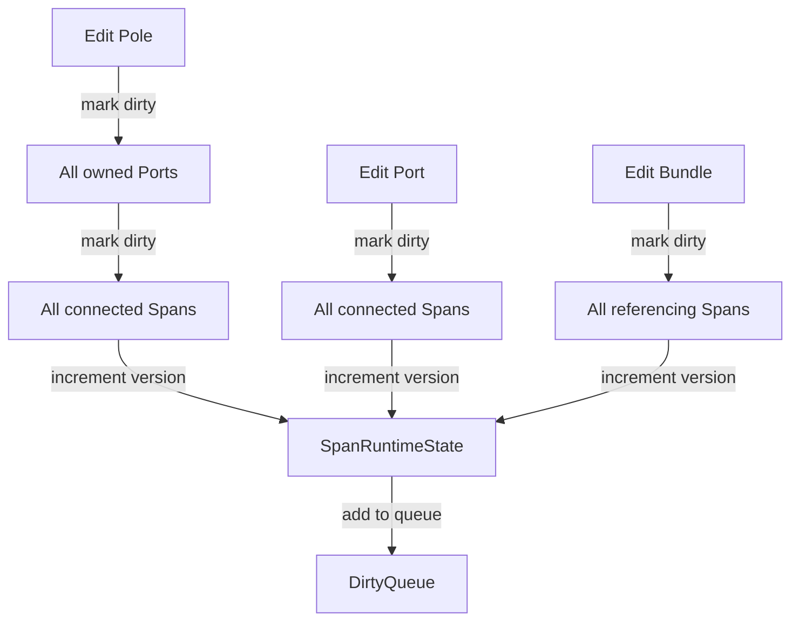

## Overview

Wire uses a sophisticated **version-based dirty tracking system** to enable efficient incremental recalculation. Instead of rebuilding the entire network when a single pole moves, only affected subsystems are marked dirty and recalculated.

<Frame>
  
</Frame>

This system enables:

- **Incremental updates**: Recalculate only what changed
- **Fine-grained tracking**: Five independent dirty flags per span
- **Version stamping**: Detect stale caches without explicit invalidation
- **Dependency management**: Automatic propagation through the topology graph

## Version Tracking

### Version Counters

Each span maintains **five independent version counters** for different subsystems:

```cpp wire/core/core_state.hpp
struct SpanRuntimeState {
  ObjectId span_id = kInvalidObjectId;
  
  // Version counters
  std::uint64_t data_version = 0;       // Entity data version
  std::uint64_t geometry_version = 0;   // CurveCache version
  std::uint64_t bounds_version = 0;     // BoundsCache version  
  std::uint64_t render_version = 0;     // VisualCache version
  std::uint64_t raycast_version = 0;    // Raycast structure version
  
  DirtyBits dirty_bits = DirtyBits::kNone;
};
```

### Version Semantics

<AccordionGroup>
  <Accordion title="data_version — Entity changes">
    Incremented when span entity data changes (ports, bundle, anchors). This is the **master version** that triggers downstream updates.
    
    ```cpp
    // Triggers data_version increment:
    state.AddSpan(port_a, port_b);
    state.DeleteSpan(span_id);
    // Moving ports connected to this span
    ```
  </Accordion>
  
  <Accordion title="geometry_version — Curve cache">
    Incremented when the curve cache (sampled wire geometry) is rebuilt. Depends on `data_version` and `GeometrySettings`.
    
    ```cpp
    // Triggers geometry_version increment:
    state.UpdateGeometrySettings({.curve_samples = 16});
    // Moving poles (changes port positions)
    ```
  </Accordion>
  
  <Accordion title="bounds_version — Bounding boxes">
    Incremented when spatial bounds are recalculated. Depends on `geometry_version`.
    
    ```cpp
    // Triggers bounds_version increment:
    // Any change that affects geometry_version
    // Used for spatial culling and raycasting
    ```
  </Accordion>
  
  <Accordion title="render_version — Visual geometry">
    Incremented when visual parts (support arms, insulators) are rebuilt. Depends on `data_version` and `VisualSettings`.
    
    ```cpp
    // Triggers render_version increment:
    state.UpdateVisualSettings({.enable_support_structures = true});
    // Changes to visual policy
    ```
  </Accordion>
  
  <Accordion title="raycast_version — Raycast structures">
    Incremented when raycast acceleration structures are rebuilt. Depends on `geometry_version`.
    
    ```cpp
    // Future: Triggers raycast_version increment
    // Spatial subdivision, BVH, or other acceleration structures
    ```
  </Accordion>
</AccordionGroup>

### Cache Version Stamping

Cache entries store the **source version** they were built from:

```cpp wire/core/core_state.hpp
struct CurveCacheEntry {
  std::vector<Vec3d> points{};          // Derived data
  std::uint64_t source_version = 0;     // Entity data_version when built
};

struct BoundsCacheEntry {
  AABBd whole{};
  std::vector<AABBd> segments{};
  std::uint64_t source_version = 0;     // geometry_version when built
};

struct SpanVisualCacheEntry {
  std::vector<VisualPart> parts{};
  std::uint64_t source_version = 0;     // data_version when built
};
```

Caches are considered **stale** when:

```cpp
bool is_stale = (cache_entry.source_version != runtime_state.data_version);
```

<Info>
Version stamping avoids the need for **explicit cache invalidation**. Caches naturally become stale when their source version falls behind the runtime version.
</Info>

## Dirty Flag System

### Dirty Bits

Each span tracks which subsystems need recalculation using **bit flags**:

```cpp wire/core/core_state.hpp
enum class DirtyBits : std::uint32_t {
  kNone = 0,
  kTopology = 1u << 0,    // Connectivity changed (rare)
  kGeometry = 1u << 1,    // Wire shape needs recalculation
  kBounds = 1u << 2,      // Bounding box needs recalculation
  kRender = 1u << 3,      // Visual parts need recalculation
  kRaycast = 1u << 4,     // Raycast structure needs rebuild
};
```

Bit flags support efficient **bitwise operations**:

```cpp
// Check if any flags are set
if (any(dirty_bits, DirtyBits::kGeometry)) {
  rebuild_geometry(span_id);
}

// Set multiple flags
dirty_bits |= DirtyBits::kGeometry | DirtyBits::kBounds;

// Clear a flag
dirty_bits &= ~DirtyBits::kGeometry;
```

### Dirty Queues

Dirty spans are accumulated in **work queues** for batch processing:

```cpp wire/core/core_state.hpp
struct DirtyQueue {
  std::vector<ObjectId> topology_dirty_span_ids;
  std::vector<ObjectId> geometry_dirty_span_ids;
  std::vector<ObjectId> bounds_dirty_span_ids;
  std::vector<ObjectId> render_dirty_span_ids;
  std::vector<ObjectId> raycast_dirty_span_ids;
};
```

Queues are processed in **dependency order**:

```
topology → geometry → bounds → render → raycast
```

<Warning>
Queues are **append-only** during modification and cleared during `Commit()`. Never process queues manually — always use `CoreState::Commit()`.
</Warning>

## Dirty Propagation

### Propagation Rules

Changes propagate through the network following **ownership and connection relationships**:



### Propagation Examples

<Tabs>
  <Tab title="Moving a Pole">
    When a pole moves, all connected spans must recalculate geometry:
    
    ```cpp
    auto result = state.MovePole(pole_id, new_transform);
    
    // Internally:
    // 1. Update pole transform (Entity Layer)
    // 2. Update all owned port positions
    // 3. For each port:
    //    - Find connected spans (ConnectionIndex)
    //    - Mark each span dirty: kGeometry | kBounds | kRender
    //    - Increment span data_version
    //    - Add to geometry_dirty_span_ids queue
    ```
  </Tab>
  
  <Tab title="Changing Geometry Settings">
    Global settings changes affect all spans:
    
    ```cpp
    state.UpdateGeometrySettings({.curve_samples = 16, .sag_enabled = true});
    
    // Internally:
    // 1. Update geometry_settings (Cache Layer)
    // 2. Mark ALL spans dirty: kGeometry | kBounds
    // 3. Add all span IDs to geometry_dirty_span_ids
    ```
  </Tab>
  
  <Tab title="Deleting a Span">
    Span deletion removes it from indexes but doesn't propagate:
    
    ```cpp
    auto result = state.DeleteSpan(span_id);
    
    // Internally:
    // 1. Remove from spans ObjectStore
    // 2. Remove from ConnectionIndex
    // 3. Remove from RelationIndex
    // 4. Remove from runtime_states
    // 5. Remove from all dirty queues
    // No propagation to other spans
    ```
  </Tab>
  
  <Tab title="Adding a Span">
    New spans are initialized as fully dirty:
    
    ```cpp
    auto result = state.AddSpan(port_a, port_b, ...);
    
    // Internally:
    // 1. Create span entity
    // 2. Initialize SpanRuntimeState with data_version = next_version++
    // 3. Mark dirty: kTopology | kGeometry | kBounds | kRender | kRaycast
    // 4. Add to all dirty queues
    ```
  </Tab>
</Tabs>

### Unidirectional Propagation

Dirty propagation is **strictly unidirectional** to avoid circular dependencies:

```
Pole → Port → Span → Cache
  ↑         ↑      ↑
  └────────┴──────┴── NO BACK-PROPAGATION
```

<Note>
Spans **never** mark their ports or poles dirty. Changes always flow **downstream** from entities to caches, never upstream.
</Note>

## Commit Process

### Commit Options

```cpp wire/core/core_state.hpp
struct CommitOptions {
  bool run_recalc = true;           // Process dirty queues?
  bool run_validate_fast = true;    // Run fast validation?
  bool run_validate = false;        // Run full validation?
};

struct CommitResult {
  RecalcStats recalc_stats{};       // Statistics from recalculation
  ValidationResult validation{};    // Validation issues (if enabled)
};
```

### Commit Workflow

```cpp
CoreState state;

// 1. Make edits (marks spans dirty)
auto r1 = state.AddPole(transform, 10.0);
auto r2 = state.AddPort(pole_id, position);
auto r3 = state.AddSpan(port_a, port_b);

// Spans are marked dirty but caches NOT rebuilt yet

// 2. Commit to process dirty queues
auto commit = state.Commit();

// 3. Check statistics
std::cout << "Processed " << commit.recalc_stats.geometry_processed 
          << " geometry updates" << std::endl;

// 4. Check validation
if (!commit.validation.ok()) {
  for (const auto& issue : commit.validation.issues) {
    std::cerr << issue.code << ": " << issue.message << std::endl;
  }
}
```

### Recalculation Order

Dirty queues are processed in **dependency order**:

<Steps>
  <Step title="Topology">
    Process `topology_dirty_span_ids` (currently minimal processing)
  </Step>
  <Step title="Geometry">
    Process `geometry_dirty_span_ids` — rebuild curve caches
  </Step>
  <Step title="Bounds">
    Process `bounds_dirty_span_ids` — compute bounding boxes from curves
  </Step>
  <Step title="Render">
    Process `render_dirty_span_ids` — generate visual parts (support arms, insulators)
  </Step>
  <Step title="Raycast">
    Process `raycast_dirty_span_ids` (future: rebuild acceleration structures)
  </Step>
</Steps>

Each stage **depends on** the previous stage:

```cpp
// Simplified internal logic
void CoreState::ProcessDirtyQueues() {
  for (ObjectId span_id : dirty_queue_.geometry_dirty_span_ids) {
    rebuild_span_curve(span_id);  // Updates CurveCache
    runtime_state.geometry_version++;
    
    // Automatically mark bounds dirty
    dirty_queue_.bounds_dirty_span_ids.push_back(span_id);
  }
  
  for (ObjectId span_id : dirty_queue_.bounds_dirty_span_ids) {
    rebuild_span_bounds(span_id);  // Uses CurveCache
    runtime_state.bounds_version++;
  }
  
  // ...
}
```

<Info>
Dependent stages are **automatically added** to queues during processing. You don't need to manually mark spans as bounds-dirty when geometry changes.
</Info>

### Recalculation Statistics

```cpp wire/core/core_state.hpp
struct RecalcStats {
  std::size_t topology_processed = 0;
  std::size_t geometry_processed = 0;
  std::size_t bounds_processed = 0;
  std::size_t render_processed = 0;
  std::size_t raycast_processed = 0;
  
  std::size_t total_processed() const {
    return topology_processed + geometry_processed + 
           bounds_processed + render_processed + raycast_processed;
  }
};
```

Example usage:

```cpp
auto commit = state.Commit();
if (commit.recalc_stats.total_processed() > 0) {
  std::cout << "Rebuilt " << commit.recalc_stats.geometry_processed 
            << " curves" << std::endl;
  std::cout << "Rebuilt " << commit.recalc_stats.render_processed 
            << " visual parts" << std::endl;
}
```

## Cache Rebuild

### Curve Cache Rebuild

Geometry recalculation samples the span curve with configurable sag:

```cpp
bool CoreState::rebuild_span_curve(ObjectId span_id, std::string* error) {
  const Span* span = edit_state_.spans.find(span_id);
  const Port* port_a = edit_state_.ports.find(span->port_a_id);
  const Port* port_b = edit_state_.ports.find(span->port_b_id);
  
  // Generate curve points with sag
  std::vector<Vec3d> points = generate_span_points(*span, error);
  
  // Update cache with version stamp
  CurveCacheEntry entry{
    .points = std::move(points),
    .source_version = span_runtime_states_[span_id].data_version
  };
  cache_state_.curve_cache.by_span[span_id] = std::move(entry);
  
  return true;
}
```

### Bounds Cache Rebuild

Bounds are computed from the curve cache:

```cpp
bool CoreState::rebuild_span_bounds(ObjectId span_id, std::string* error) {
  const CurveCacheEntry* curve = find_curve_cache(span_id);
  if (!curve) return false;
  
  // Compute AABB from curve points
  AABBd whole = build_aabb_from_points(curve->points);
  
  // Update cache with version stamp
  BoundsCacheEntry entry{
    .whole = whole,
    .source_version = span_runtime_states_[span_id].geometry_version
  };
  cache_state_.bounds_cache.by_span[span_id] = std::move(entry);
  
  return true;
}
```

### Visual Cache Rebuild

Visual parts are generated based on port and anchor positions:

```cpp
bool CoreState::rebuild_span_visual(ObjectId span_id, std::string* error) {
  const Span* span = edit_state_.spans.find(span_id);
  // ... generate support arms, insulators, etc.
  
  SpanVisualCacheEntry entry{
    .parts = std::move(visual_parts),
    .source_version = span_runtime_states_[span_id].data_version
  };
  cache_state_.visual_cache.by_span[span_id] = std::move(entry);
  
  return true;
}
```

## Performance Considerations

### Batching Edits

Batch multiple edits before committing for better performance:

<Tabs>
  <Tab title="Good: Batched">
    ```cpp
    // Make all edits first
    for (const Vec3d& pos : positions) {
      state.AddPole(Transformd{.position = pos}, 10.0);
    }
    
    // Single commit processes all changes
    auto commit = state.Commit();
    ```
  </Tab>
  
  <Tab title="Bad: Per-Edit">
    ```cpp
    // Commit after every edit
    for (const Vec3d& pos : positions) {
      state.AddPole(Transformd{.position = pos}, 10.0);
      state.Commit();  // Inefficient!
    }
    ```
  </Tab>
</Tabs>

### Skipping Recalculation

For bulk imports, skip recalculation until the end:

```cpp
// Import phase: don't recalculate
for (const auto& pole_data : import) {
  state.AddPole(pole_data.transform, pole_data.height);
  // Spans marked dirty but not processed
}

// Final commit with recalculation
auto commit = state.Commit({.run_recalc = true});
```

### Dirty Queue Size

Monitor dirty queue size for performance insights:

```cpp
CoreView view = state.view();
const DirtyQueue& queue = view.dirty_queue();

std::cout << "Pending geometry updates: " 
          << queue.geometry_dirty_span_ids.size() << std::endl;

if (queue.geometry_dirty_span_ids.size() > 1000) {
  std::cout << "Warning: Large dirty queue, consider batching" << std::endl;
}
```

<Tip>
For **large networks** (>10,000 spans), consider processing dirty queues in chunks or deferring non-critical updates (like visual parts) until needed.
</Tip>

## Debugging Dirty State

### Inspecting Runtime State

```cpp
CoreView view = state.view();
const SpanRuntimeState* runtime = view.find_span_runtime_state(span_id);

if (runtime) {
  std::cout << "Span " << span_id << " versions:" << std::endl;
  std::cout << "  data: " << runtime->data_version << std::endl;
  std::cout << "  geometry: " << runtime->geometry_version << std::endl;
  std::cout << "  bounds: " << runtime->bounds_version << std::endl;
  
  if (any(runtime->dirty_bits, DirtyBits::kGeometry)) {
    std::cout << "  DIRTY: geometry needs rebuild" << std::endl;
  }
}
```

### Cache Staleness Check

```cpp
const SpanRuntimeState* runtime = view.find_span_runtime_state(span_id);
const CurveCacheEntry* curve = state.find_curve_cache(span_id);

if (curve && runtime) {
  if (curve->source_version != runtime->data_version) {
    std::cout << "STALE: curve version " << curve->source_version 
              << " != data version " << runtime->data_version << std::endl;
  } else {
    std::cout << "Fresh: curve cache is up-to-date" << std::endl;
  }
}
```

## Next Steps

<CardGroup cols={2}>
  <Card title="Architecture" icon="diagram-project" href="/concepts/architecture">
    Review the 4-layer architecture
  </Card>
  <Card title="Core State API" icon="code" href="/api/core-state">
    Learn the editing and commit API
  </Card>
  <Card title="Performance Guide" icon="gauge-high" href="/guides/incremental-recalc">
    Optimize for large networks
  </Card>
  <Card title="Validation" icon="shield-check" href="/guides/validation">
    Understand topology validation
  </Card>
</CardGroup>